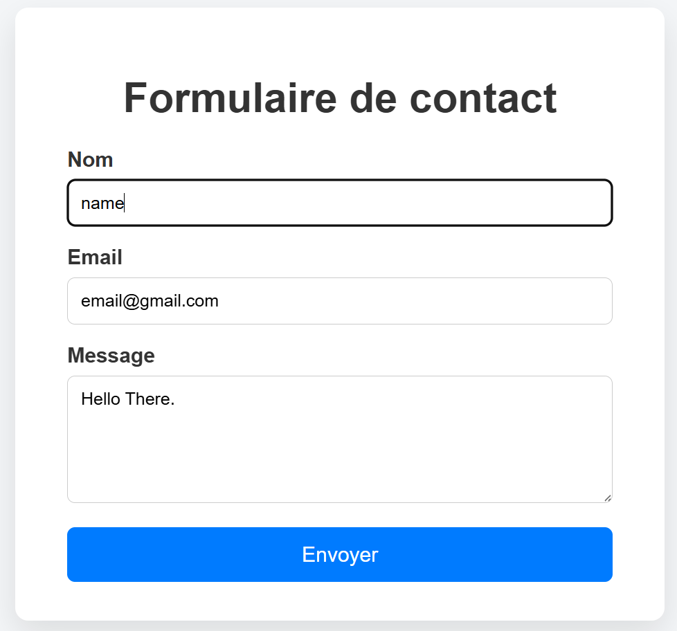
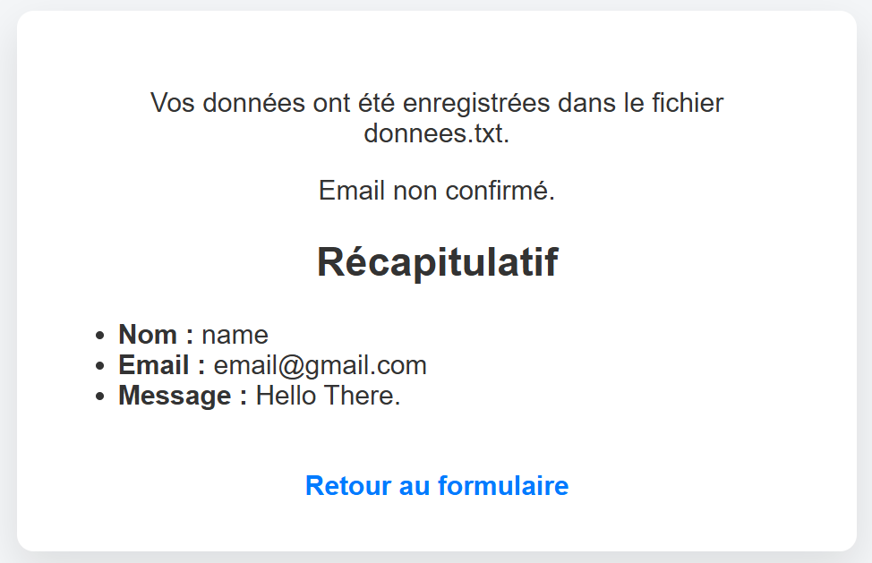

# PHP TP – Contact Form (Web Programming)

## Overview

This project is a **practical assignment (Travaux Pratiques – TP)** developed as part of the **Web Programming** course at the university.  
It was assigned by the professor to practice server-side web development using **PHP**.

The objective of this TP is to understand how HTML forms are processed in PHP, how user input is validated and secured, how data can be stored in files, and how email sending works in PHP.

---

## Project Features

The application provides a simple contact form that allows the user to enter:

- Name
- Email address
- Message

When the form is submitted, the following actions are performed:

1. The data is sent using the `POST` method
2. Inputs are cleaned and secured using `htmlspecialchars`
3. All fields are checked to ensure they are not empty
4. The data is saved in a text file called `donnees.txt`
5. An attempt to send an email is made
6. A summary of the submitted data is displayed

---

## Code Behavior

- A single PHP file is used to display the form and handle its processing
- CSS is embedded to provide a clean and centered layout
- The content is centered vertically and horizontally
- The interface is simple, readable, and responsive
- Code duplication is avoided to keep the project clean and structured

<!--


-->
 

---

## Email Sending Result

The email result displayed by the application will **always be**:

**Email non confirmé**

### Reason

The native PHP function used to send emails is:

```php
mail();
```
This function does not send emails by itself.

It requires:

- A configured mail server

- An active SMTP service

In a local development environment such as XAMPP, WAMP, or Laragon, no SMTP server is configured by default.
Therefore, even if the PHP code is correct, the email cannot be confirmed.

### Recommended Solution

For real-world applications, it is recommended to use an SMTP library such as:

- PHPMailer

- Symfony Mailer

PHPMailer can be configured with services like:

- Gmail

- Outlook

Using PHPMailer allows:

- Secure SMTP authentication

- Reliable email delivery

- Real confirmation that emails are sent

---

## Educational Purpose

This TP helps students to:

- Understand HTML form handling in PHP

- Secure and validate user input

- Write data to files using PHP

- Understand the limitations of PHP’s mail() function

- Learn good practices in server-side web development

---

## Contributing:
Contributions are welcome! If you'd like to add more features or improve the project, feel free to fork the repository and create a pull request. <br>
If you lake it Give me some ⭐
